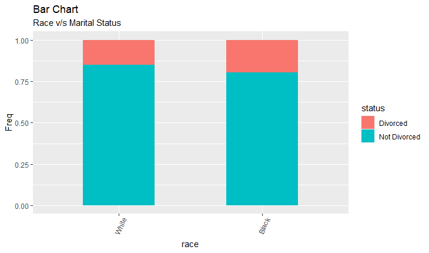
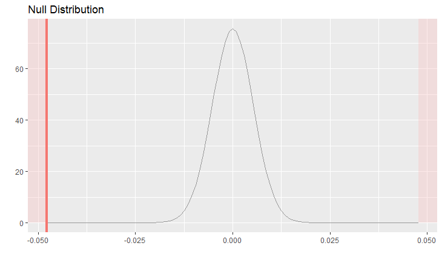

Inferential Statistics Project
==============================


A study on Divorce rates among different ethnicities in United States
---------------------------------------------------------------------


Introduction:
-------------

The purpose of this document is to complete the data analysis project required during week 5 of the Inferential Statistics course by Duke University (Coursera).

The background context regarding the assignment can be found at: <https://www.coursera.org/learn/inferential-statistics-intro/peer/TRNOq/data-analysis-project>

Setup
-----

### Load packages

``` r
library(ggplot2)
library(dplyr)
library(statsr)
```

------------------------------------------------------------------------

Part 1: Data
------------

**Load the data**:

``` r
load("gss.Rdata")
```

### Data Description:

This project uses an extract of the General Social Survey (GSS) Cumulative File 1972-2012 that was provided by Coursera.

Since 1972, the General Social Survey (GSS) has been monitoring societal change and studying the growing complexity of American society. The GSS aims to gather data on contemporary American society in order to monitor and explain trends and constants in attitudes, behaviors, and attributes; to examine the structure and functioning of society in general as well as the role played by relevant subgroups; to compare the United States to other societies in order to place American society in comparative perspective and develop cross-national models of human society; and to make high-quality data easily accessible to scholars, students, policy makers, and others, with minimal cost and waiting.

GSS questions cover a diverse range of issues including national spending priorities, marijuana use, crime and punishment, race relations, quality of life, confidence in institutions, and sexual behavior.

The data extract contains 57061 observations of 114 variables.

#### Sampling Technique:

The GSS sample is drawn using an area probability design. Using NORC's sample frame of United States addresses, a mix of urban, suburban, and rural National Frame Areas (NFAs) are scientifically selected to represent the nation. Segments are selected from these NFAs and addresses are selected from within each segment. All cases are released to interviewers at the beginning of data collection.The vast majority of GSS data is obtained in face-to-face interviews. All in all the methodology ensures that the sampling is random.

#### Limitations and Analysis of the data:

A number of details about the sample of the GSS must be considered when analyzing the data and applying weights.

1.  The 1982 and 1987 GSSs included oversamples of black respondents. To adjust statistical results for this oversampling, one may either exclude cases in the black oversamples or weight statistical results using specialized weights.

2.  Only one adult per household is interviewed, so persons living in large households have lower probabilities of selection. For person-level variables, weighting statistical results in proportion to the number of persons aged 18 or over in the household can compensate for this.

3.  Responses from persons in the sub-sample beginning in 2004 must be weighted up in order to represent all of those who had not responded by the time the subsample was drawn.

### Generalizability and drawing Causal Conclusions?

The data collection is randon as a result of which we can generalize the findings to the entire population. As the data is an observational study conducted over a period of time we cannot deduce any causalty from the data alone. This is because the answers provided by the respondents are prone to bias. In order to deduce causal relations we will have to conduct random clinical trials.

------------------------------------------------------------------------

Part 2: Research question
-------------------------

**Studying divorce rates among the White and the Black population in America?**

In this project, i'm interested in finding out whether there is a significant difference in the divorce rates among the white and the black population in America. This is an improtant issue to be studied because a difference in divorce rates among different races would indicate that there might be some underlying socio-economic factors leading to increased divorce rates in a particular race. One could then investigate which socio-economic factors are affecting the race and take necessary steps in the right direction. Low divorce rates will result in an increase in social wellbeing.

------------------------------------------------------------------------

Getting the data ready for our analysis:
----------------------------------------

We first convert our dataset into tibble data format for ease of working.

``` r
gss<-tbl_df(gss)
```

Next we create a data frame 'data' by subsetting from the data frame 'gss'. The new data frame:

1.  Contains the columns race and marital from the original data set.

2.  Contains rows in which race is either White or Black and marital status is Married, Widowed, Separated, Divorced.

``` r
data<-filter(select(gss, race, marital), race %in% c("White", "Black"), marital %in% c("Married","Widowed","Separated","Divorced"))
```

``` r
data
```

    ## # A tibble: 43,426 x 2
    ##    race  marital 
    ##    <fct> <fct>   
    ##  1 White Married 
    ##  2 White Married 
    ##  3 White Married 
    ##  4 White Married 
    ##  5 White Divorced
    ##  6 Black Married 
    ##  7 Black Married 
    ##  8 Black Married 
    ##  9 Black Married 
    ## 10 Black Divorced
    ## # ... with 43,416 more rows

``` r
unique(data$race)
```

    ## [1] White Black
    ## Levels: White Black Other

``` r
unique(data$marital)
```

    ## [1] Married   Divorced  Widowed   Separated
    ## Levels: Married Widowed Divorced Separated Never Married

Next we remove the dummy factor levels Other and Never Married from the columns race and marital respectively.

``` r
data$race<-factor(data$race)

data$marital<-factor(data$marital)
```

``` r
unique(data$race)
```

    ## [1] White Black
    ## Levels: White Black

``` r
unique(data$marital)
```

    ## [1] Married   Divorced  Widowed   Separated
    ## Levels: Married Widowed Divorced Separated

As we are interested in the divorced individuals among both the races we will group all the other factor levels(Married, Separated, Widowed) of the variable marital as Not Divorced.

(This is mainly because later in our inferential study we will consider divorce as a success and every other marital status in the column marital of data as a failure.)

``` r
status<-as.factor(ifelse(data$marital %in% c("Married","Widowed","Separated"),"Not Divorced", "Divorced"))
```

Finally we add a new variable named status to data wihich has exactly two factor levels Divorced and Not Divorced.

``` r
data<-mutate(data, status)
```

``` r
data
```

    ## # A tibble: 43,426 x 3
    ##    race  marital  status      
    ##    <fct> <fct>    <fct>       
    ##  1 White Married  Not Divorced
    ##  2 White Married  Not Divorced
    ##  3 White Married  Not Divorced
    ##  4 White Married  Not Divorced
    ##  5 White Divorced Divorced    
    ##  6 Black Married  Not Divorced
    ##  7 Black Married  Not Divorced
    ##  8 Black Married  Not Divorced
    ##  9 Black Married  Not Divorced
    ## 10 Black Divorced Divorced    
    ## # ... with 43,416 more rows

``` r
str(data$status)
```

    ##  Factor w/ 2 levels "Divorced","Not Divorced": 2 2 2 2 1 2 2 2 2 1 ...

We now have a data frame on which we can perform our analysis.

------------------------------------------------------------------------

Part 3: Exploratory data analysis
---------------------------------

The following is a summary of the data frame data.

``` r
summary(data)
```

    ##     race            marital               status     
    ##  White:38019   Married  :29376   Divorced    : 6775  
    ##  Black: 5407   Widowed  : 5422   Not Divorced:36651  
    ##                Divorced : 6775                       
    ##                Separated: 1853

Below is a contengenncy table of status v/s race

``` r
table(select(data, status, race))
```

    ##               race
    ## status         White Black
    ##   Divorced      5705  1070
    ##   Not Divorced 32314  4337

### Barplot for Race and Divorce status:

We will construct a segmented barplot for which we create the folowing data frame.

``` r
df<-as.data.frame(table(select(data, status, race)))

df
```

    ##         status  race  Freq
    ## 1     Divorced White  5705
    ## 2 Not Divorced White 32314
    ## 3     Divorced Black  1070
    ## 4 Not Divorced Black  4337

``` r
ggplot(df, aes(race,Freq)) + geom_bar(aes(fill=status), width = 0.5, stat = "identity", position = "fill") + labs(title="Bar Chart", subtitle="Race and Marital Status") + theme(axis.text.x = element_text(angle=65, vjust=0.6)) 
```



**Observations:** The barplot above has racial ethnicity on the x-axis and each bar has been segmented according to the divorce status. It is clearly visible that the proportion of divorce is higher among Blacks than the proportion of divorce among Whites.

We will perform inference to test whether the divorce rates vary by ethnicity or the difference observed in the data was just because of chance.

------------------------------------------------------------------------

Part 4: Inference
-----------------

There are two categorical variables under consideration here, race and divorce status. Both the variables have exactly two levels. We would like to make conclusions about the difference in proportion of divorce in Whites and Blacks

Let,

*p*<sub>*w*</sub>: population proportion of divorced White individuals.

*p*<sub>*b*</sub>: population proportion of divorced Black individuals.

### Hypothesis:

*H*<sub>0</sub> : *p*<sub>*w*</sub> − *p*<sub>*b*</sub> = 0

$H\_A: p\_w-p\_b \\not=0$

*n*<sub>*w*</sub> = 38019, $\\hat{p}\_w=0.1501$

*n*<sub>*b*</sub> = 5407, $\\hat{p}\_b=0.1979$

$p\_{pooled}=\\frac{5705+1070}{38019+5407}=0.1560$

### Conditions:

To perform inference for two independent categorical variables the following two conditions must be satisfied.

1.  **Success-Failure condition:**

    *n*<sub>*w*</sub>*p*<sub>*p**o**o**l**e**d*</sub> = 5931 and *n*<sub>*w*</sub>(1 − *p*<sub>*p**o**o**l**e**d*</sub>)=32088

    *n*<sub>*b*</sub>*p*<sub>*p**o**o**l**e**d*</sub> = 843 and *n*<sub>*b*</sub>(1 − *p*<sub>*p**o**o**l**e**d*</sub>)=4563.

As the success failure condition is met, the distribution of differences $\\hat{p}\_w-\\hat{p}\_b$ is nearly normal.

1.  **Independence:**

The sample in consideration clearly contains less than 10% of the data from the entire population. Hence one can assume that the obserations are independent.

### Inference for the difference of proportion for two independent categorical variables:

As the success-failure condition is met we will run a theoretical inference test in *R*

``` r
inference(data$status, data$race, data, type="ht", statistic = "proportion", success = "Divorced", method = "theoretical", null=0, alternative = "twosided", show_eda_plot = F)
```

    ## Response variable: categorical (2 levels, success: Divorced)
    ## Explanatory variable: categorical (2 levels) 
    ## n_White = 38019, p_hat_White = 0.1501
    ## n_Black = 5407, p_hat_Black = 0.1979
    ## H0: p_White =  p_Black
    ## HA: p_White != p_Black
    ## z = -9.0699
    ## p_value = < 0.0001



As the *p*-value is less than 0.05, we reject *H*<sub>0</sub>.

### 95% confidence interval for the difference of proportion:

As *H*<sub>0</sub> was rejected at a significance level of 0.05, we will expect that the 95% CI will not contain 0. This can be seen below,

``` r
inference(data$status, data$race, data, type="ci", statistic = "proportion", success = "Divorced", method = "theoretical", null=0, alternative = "twosided", show_eda_plot = F)
```

    ## Response variable: categorical (2 levels, success: Divorced)
    ## Explanatory variable: categorical (2 levels) 
    ## n_White = 38019, p_hat_White = 0.1501
    ## n_Black = 5407, p_hat_Black = 0.1979
    ## 95% CI (White - Black): (-0.059 , -0.0366)

### Findings and scope for future research:

As the *p*-value is almost zero we have strong evidence that in United States the proportion of individuals getting divorced is significantly higher in Blacks than in Whites.

Numerous studies show that even in todays date rascism is deeply rooted in the society, which results in lesser opportunites for the Blacks and hence a low socio-economic status. The above research can be extended further by finding whether the socio-economic status and divorce are related for the Black population. As a result of the study if one finds that socio-economic status and divorce rates are inversely proportional then one would have strong evidence that racism is indirectly leading to higher divorce rates among the Blacks.
